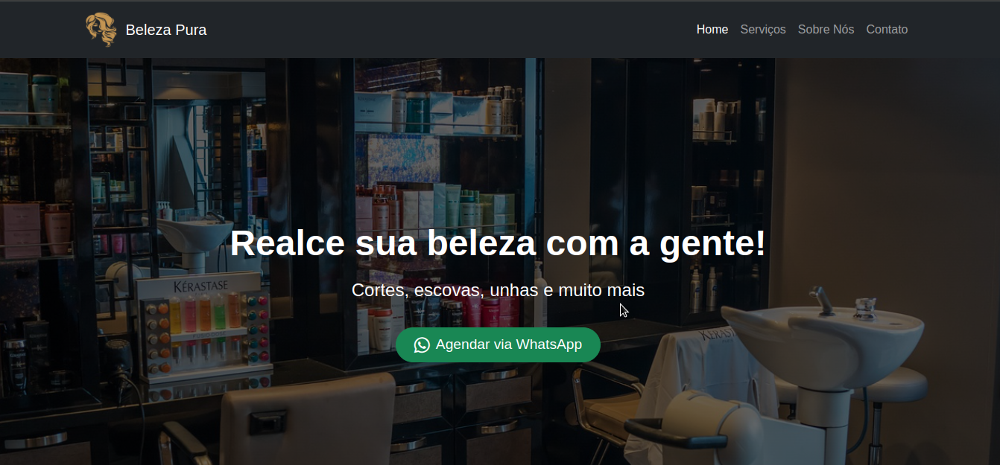

# Site Salão de Beleza

Este é um projeto de site one-page com seções como Home, Serviços, Sobre mim e Contato, e um botão de "Voltar ao Topo", desenvolvido com HTML, CSS (Bootstrap), e FontAwesome.

---

## 📸 Prévia do Site

---

## 🚀 Funcionalidades

- Layout responsivo com Bootstrap
- Seção Hero com chamada de ação
- Lista de serviços com efeitos visuais
- Seção de contato com ícones e mapa integrado
- Ícones profissionais com FontAwesome
- Botão de "Voltar ao Topo" para melhorar a navegação

---

## 🛠️ Tecnologias Utilizadas

- HTML5
- CSS3
- Bootstrap 5
- FontAwesome

---

